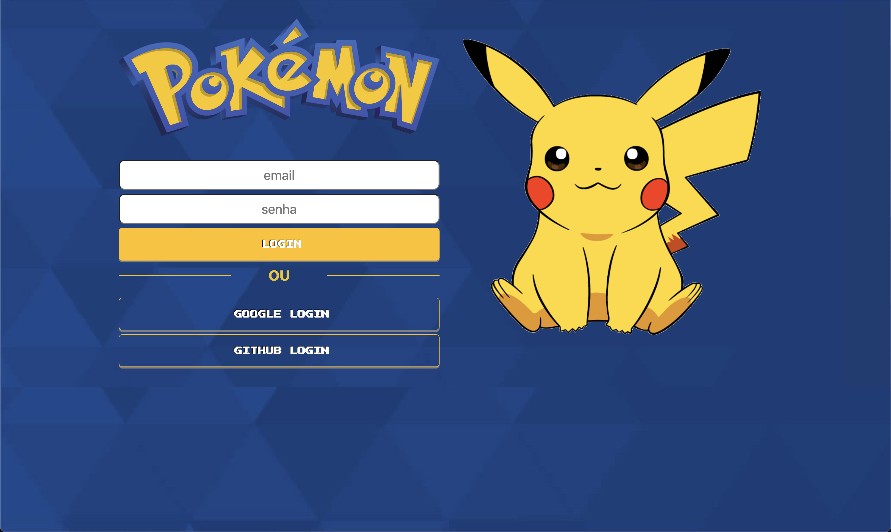
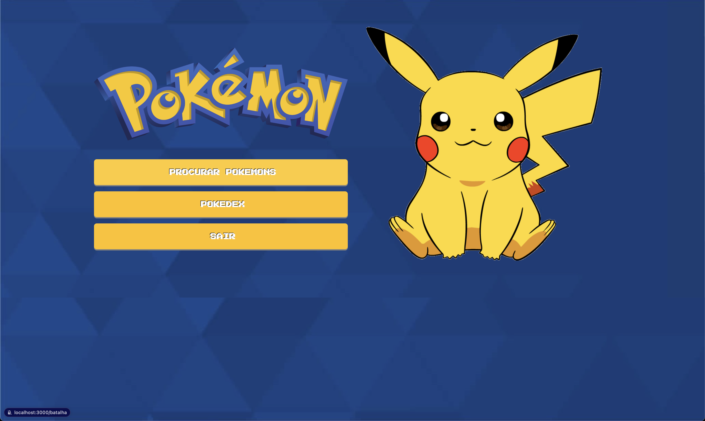
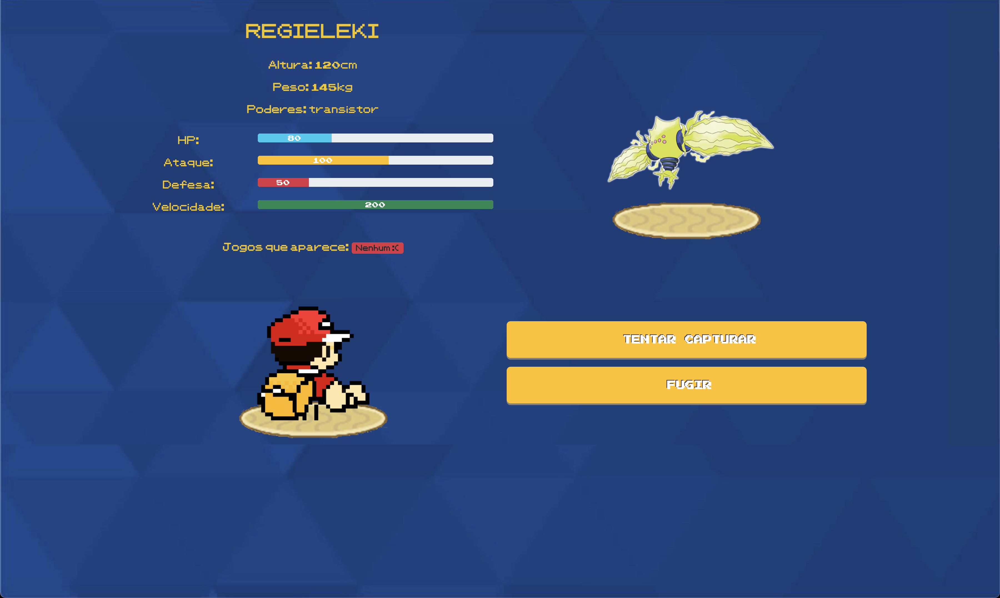
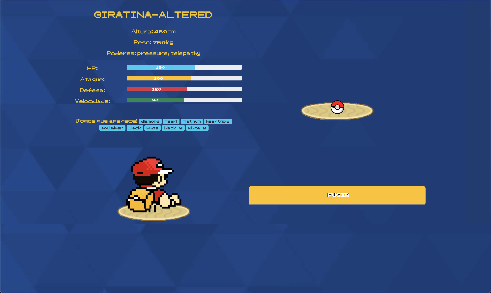
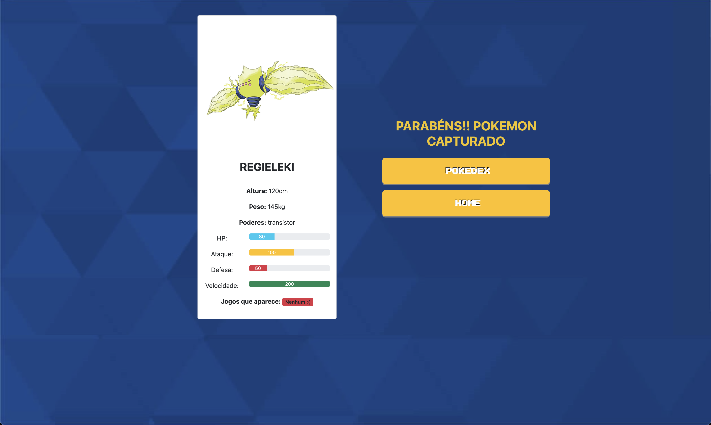
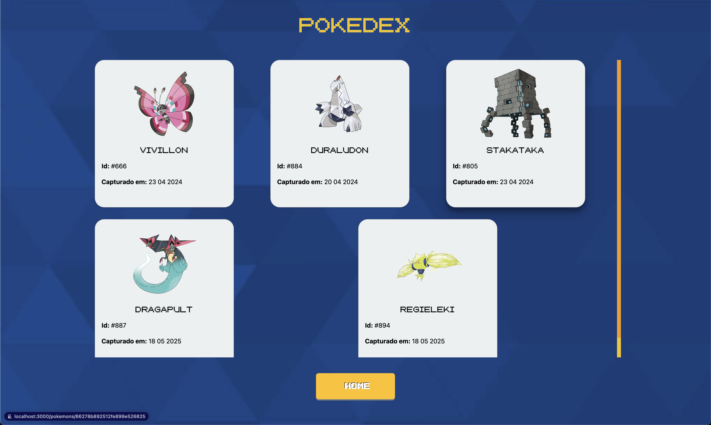

# EBAC Node Pokedex

> Projeto de exemplo desenvolvido durante o curso de Node.js da EBAC. Trata-se de uma Pokédex simples que exibe lista de Pokémons, detalhes e imagens, utilizando Express e EJS.

---

## Índice

- [Sobre](#sobre)
- [Tecnologias](#tecnologias)
- [Pré-requisitos](#pré-requisitos)
- [Instalação e execução](#instalação-e-execução)
- [Variáveis de ambiente](#variáveis-de-ambiente)
- [Estrutura do projeto](#estrutura-do-projeto)
- [Scripts disponíveis](#scripts-disponíveis)
- [Contribuição](#contribuição)
- [Fotos](#fotos)
- [Licença](#licença)

---

## Sobre

Esta é uma aplicação de exemplo criada como projeto de conclusão do módulo de Node.js da EBAC. A Pokédex permite:

- Listar Pokémons com nome e imagem;
- Visualizar detalhes de cada Pokémon;
- Navegar entre diferentes rotas usando Express e rotas dinâmicas.

---

## Tecnologias

- **Node.js**
- **Express**
- **EJS** (Embedded JavaScript Templates)
- **JavaScript (ES6+)**
- **CSS** (estilos básicos)
- **Nodemon** (desenvolvimento)

---

## Pré-requisitos

- **Node.js** v14 ou superior
- **npm** ou **yarn**

---

## Instalação e execução

1. **Clone o repositório**

   ```bash
   git clone https://github.com/feliperogerioalmeida/ebac-node-pokedex.git
   cd ebac-node-pokedex
   ```

2. **Instale as dependências**

   ```bash
   npm install
   # ou
   yarn install
   ```

3. **Configure as variáveis de ambiente**

   - Copie o arquivo `.env.example` para `.env`
   - Ajuste valores (como `PORT`) se necessário

4. **Inicie a aplicação**

   ```bash
   npm run dev
   # ou
   yarn dev
   ```

5. **Acesse**
   Abra o navegador em `http://localhost:3000` (ou na porta configurada).

---

## Variáveis de ambiente

```env
MONGO_URL = 'URL do mongo'

POKE_API = "https://pokeapi.co/api/v2/pokemon/"

SEGREDO_JWT = 'segredo-qualquer'

SESSION_SECRET = 'segredo-qualquer'

GOOGLE_OAUTH_CLIENT_ID = 'ID cliente google'

GOOGLE_OAUTH_CLIENT_SECRET = 'Client secret google'

GOOGLE_OAUTH_REDIRECT_URI = 'http://localhost:3000/auth/oauth2/redirect/google'

GITHUB_REDIRECT_URI = 'http://localhost:3000/auth/oauth2/redirect/github'

GITHUB_CLIENT_ID = 'github cliet id'

GITHUB_CLIENT_SECRET = 'github client secret'
```

---

## Estrutura do projeto

```text
├── app.js                # Ponto de entrada do servidor Express
├── routes/               # Definição de rotas
├── services/             # Lógica de consumo de dados (ex.: API de Pokémons)
├── views/                # Templates EJS
│   ├── index.ejs         # Lista de Pokémons
│   └── details.ejs       # Página de detalhes
├── public/               # Arquivos estáticos (CSS, imagens)
├── models/               # Modelos e schemas (se aplicável)
├── seed.js               # Script para popular dados iniciais (se houver)
├── .env.example          # Exemplo de variáveis de ambiente
├── package.json          # Dependências e scripts
└── README.md             # Documentação do projeto
```

---

## Scripts disponíveis

| Comando        | Descrição                              |
| -------------- | -------------------------------------- |
| `npm run dev`  | Inicia o servidor com Nodemon          |
| `npm start`    | Inicia a aplicação em modo de produção |
| `npm run lint` | Executa ESLint (se configurado)        |

---

## Contribuição

Contribuições são bem-vindas! Siga os passos abaixo:

1. Faça um fork deste repositório.
2. Crie uma branch: `git checkout -b feature/nome-da-feature`.
3. Faça commit das alterações: `git commit -m 'feat: descrição da feature'`.
4. Envie para o branch original: `git push origin feature/nome-da-feature`.
5. Abra um Pull Request.

---

## Fotos

### Home

<p align="center">
 
  
</p>

### Logged In

<p align="center">
 
  
</p>

### Battle

<p align="center">
 
  
</p>

### Capturing

<p align="center">
 
  
</p>

### Captured

<p align="center">
 
  
</p>

### Pokedex

<p align="center">
 
  
</p>

---

## Licença

Distribuído sob a [MIT License](LICENSE).
